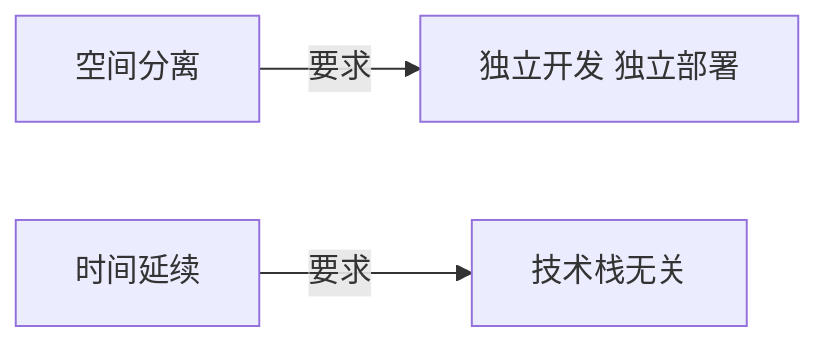

# 目录

- <mdi-house class="text-red-400" /><Link to="5">概念基础</Link>
- <mdi-laptop-chromebook class="text-blue-400" /> 应用管理
- <mdi-lifebuoy class="text-yellow-400" /> 生命周期管理
- <mdi-road-variant  class="text-pink-400"/> 路由管理

---
layout: image-right
---

# 概念基础

- 什么是微前端？
- 微前端解决什么问题？
- 微前端框架的核心问题是什么？
- 微前端的3种类型

---

# 什么是微前端？

- 微前端是指存在于**浏览器中的微服务**。
- 多应用：微前端作为用户界面的一部分，通常由许多微应用（微组件）组成，并使用**视图框架来渲染微应用**。
- 技术栈无关：每个微前端可以由不同的团队进行管理，并可以**自主选择框架**。
- 独立部署：每个微前端都拥有**独立的构建进程和部署流程**。

<mark>“技术栈无关”是微前端的核心价值。</mark>

---

# 微前端解决什么问题？

微前端解决<b>可控体系下前端协同开发</b>问题。

- 空间分离带来的协作复杂性
- 时间延续带来的维护复杂性

  

---

# 微前端框架的核心问题是什么？

- 应用的**加载与切换**。包括路由的处理、应用加载的处理和应用入口的选择。
- 应用的**隔离与通信**。包括 JS 的隔离、样式的隔离、父子应用和子子应用之间的通信问题。

<Alert type='tip'>single-spa 主要解决了问题一，qiankun 主要解决了问题二。</Alert>

---

# 微前端的 3 种类型

在single-spa中，有以下三种微前端类型：

- **applications**: 为一组**特定路由**渲染组件的微前端。
- **parcels**: **不受路由控制**，渲染组件的微前端。
- **utility modules**: 非渲染组件，用于暴露共享工具逻辑的微前端。

一个web应用可能包含一种或多种类型的微前端。

---

# 应用管理
