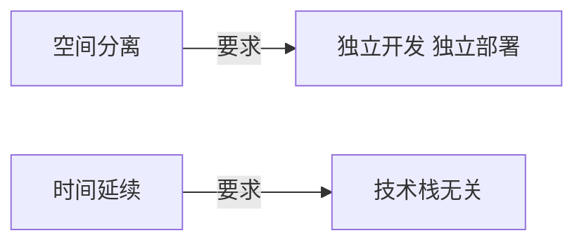

# 目录

- <mdi-house class="text-red-400" /><Link to="5">概念基础</Link>
- <mdi-laptop-chromebook class="text-blue-400" /> <Link to="12">应用管理</Link>
- <mdi-lifebuoy class="text-yellow-400" /> <Link to="15">生命周期管理</Link>
- <mdi-road-variant  class="text-pink-400"/> <Link to="24">路由管理</Link>

<Alert type="info"><span>文档：<a href="https://source.jonsam.site/single-spa/index/" target="_blank">single-spa源码阅读 | FancyFE</a></span></Alert>

---
layout: image-right
---

# 概念基础

- 什么是微前端？
- 微前端解决什么问题？
- 微前端的3种类型
- 微前端框架的核心问题是什么？
- 了解 Single-spa
- Single-spa 目录结构

<FixedImage src="https://itvdn.blob.core.windows.net/specialities-covers/frontend-developer-678e66fd-e694-4184-a389-e9a90d0cb5c8.png" r="0" b="0"  />

---

## 什么是微前端？

- 微前端是指存在于**浏览器中的微服务**。
- 多应用：微前端作为用户界面的一部分，通常由许多微应用（微组件）组成，并使用**视图框架来渲染微应用**。
- 技术栈无关：每个微前端可以由不同的团队进行管理，并可以**自主选择框架**。
- 独立部署：每个微前端都拥有**独立的构建进程和部署流程**。

<Alert type="tip">“技术栈无关”是微前端的核心价值。</Alert>

<FixedImage src="https://cdn.staticaly.com/gh/jonsam-ng/image-hosting@master/20220718/image.2m4uo50e6r20.png" r="0" b="0" w="40%"/>

---

## 微前端解决什么问题？

微前端解决<b>可控体系下前端协同开发</b>问题。

- 空间分离带来的协作复杂性
- 时间延续带来的维护复杂性

<br/><br/>



<FixedImage src="https://cdn.staticaly.com/gh/jonsam-ng/image-hosting@master/20220718/image.49o0p8lzjgm0.png" r="-40px" b="0" w="66%" />

---

## 微前端的 3 种类型

在single-spa中，有以下三种微前端类型：

- **applications**: 为一组**特定路由**渲染组件的微前端。
- **parcels**: **不受路由控制**，渲染组件的微前端。
- **utility modules**: 非渲染组件，用于暴露共享工具逻辑的微前端。

一个web应用可能包含一种或多种类型的微前端。

<Alert type="info"><span>参考：<a href='https://zh-hans.single-spa.js.org/docs/microfrontends-concept/#%E5%BE%AE%E5%89%8D%E7%AB%AF%E7%B1%BB%E5%9E%8B' target='_blank'>Single-Spa微前端类型</a></span></Alert>

<FixedImage src="https://cdn.staticaly.com/gh/jonsam-ng/image-hosting@master/20220719/image.1vkv4ys6rw80.png" r="-60px" w="60%" b="0" />

---

## 微前端框架的核心问题是什么？

微前端框架需要解决两个核心问题：

- 应用的**加载与切换**。包括路由的处理、应用加载的处理和应用入口的选择。
- 应用的**隔离与通信**。包括 JS 的隔离、样式的隔离、父子应用和子子应用之间的通信问题。

<Alert type='tip'>Single-spa 主要解决了问题一，Qiankun 主要解决了问题二。</Alert>

<FixedImage src='https://cdn.staticaly.com/gh/jonsam-ng/image-hosting@master/20220718/image.3zguhz3vw9c0.png' r='-80px' b="-30px" />

---
layout: image-left
image: 'https://cdn.staticaly.com/gh/jonsam-ng/image-hosting@master/20220719/image.5m66hfy5fq80.png'
---

## 了解 Single-spa

Single-spa 是一个将多个单页面应用（SPA）聚合为一个整体应用的 JavaScript 微前端框架。

Single-spa 的特性：

- 框架无关
- 独立部署
- 新应用与旧应用共存
- 应用延迟加载

<Alert type="info"><span>官网：<a href='https://zh-hans.single-spa.js.org/docs/getting-started-overview' target='_blank'>快速开始</a>；GitHub：<a href='https://github.com/single-spa/single-spa' target='_blank'>Repo</a></span></Alert>

---
layout: two-cols
---

## Single-spa 目录结构

```txt
src
├── applications 应用管理
├── lifecycles 生命周期
│   ├── bootstrap.js
│   ├── load.js
│   ├── mount.js
│   ├── unload.js
│   ├── unmount.js
│   └── update.js
├── navigation 路由管理
├── parcels 管理 parcel 应用
├── single-spa.js
├── start.js
```

::right::

Single-spa 在微应用的层面做了三件事：

- 微应用管理
- 微应用生命周期管理
- 路由管理

<Alert type="tip"><span>Single-spa 具有很灵活的使用场景，基于此可以封装出适合企业的各种轻量级的微前端的框架。（如 Qiankun）</span></Alert>

<FixedImage src="https://cdn.staticaly.com/gh/jonsam-ng/image-hosting@master/20220719/image.5ctq8anlan00.png" r="0" b="0" :o="0.3" w="30%" />

---
layout: image-right
image: 'https://cdn.staticaly.com/gh/jonsam-ng/image-hosting@master/20220719/image.6ge383gttf4.png'
---
# 应用管理

- registerApplication 和 unregisterApplication
- Loading Function 和 Active Function

---
layout: two-cols
---

## registerApplication

<style>
  .slidev-code-wrapper {
    margin-right: 6px!important;
  }
</style>

注册微应用

```js
// src/applications/apps.js
const apps = [];
const isInBrowser = typeof window !== "undefined";
function registerApplication(appNameOrConfig,appOrLoadApp,activeWhen,customProps) {
  // 参数消毒
  const registration = sanitizeArguments(/*......*/);
  // 检查重复注册
  // ......
  // 加入微应用列表，并合并默认配置
  apps.push(assign({/*......*/},registration);
  if (isInBrowser) {
    // 调整路由监听，初始化或者应用配置变化
    reroute();
  }
}
```

<Alert type="info"><span>参考：<a href="https://zh-hans.single-spa.js.org/docs/configuration#%E6%B3%A8%E5%86%8C%E5%BA%94%E7%94%A8" target="_blank">注册应用</a></span></Alert>

::right::

## unregisterApplication

删除微应用

```js
function unregisterApplication(appName) {
  // ......
  // 卸载应用并且将应用从应用列表中删除
  return unloadApplication(appName).then(() => {
    const appIndex = apps.map(toName).indexOf(appName);
    apps.splice(appIndex, 1);
  });
}
```

---
layout: two-cols
---

## Loading Function

<style>
  ul li {
    font-size: 12px;
  }
</style>

加载函数

- 返回promise的函数（或"async function"方法）；
- 应用第一次被下载（加载）时调用；
- Promise resolve之后的结果必须是一个可以被解析的应用；

## Active Function

激活函数：根据路由决定该应用是否需要被激活

调用时机：

- hashchange 或者 popstate事件触发时；
- pushState 或者 replaceState被调用时；
- 手动调用 `triggerAppChange` 方法；
- checkActivityFunctions方法被调用时。

::right::

Qiankun 的应用案例：

```js
registerApplication({
  name,
  app: async () => {
    loader(true);
    // 等待应用启动，即是 frameworkStartedDefer.promise 被 resolve
    await frameworkStartedDefer.promise;
    // 挂载子应用，获得子应用的钩子和配置
    // loadApp 是在应用启动（start 函数）之后执行的，但是再次之前在 s-spa 中已经注册了应用
    const {
      mount,
      ...otherMicroAppConfigs
    } = // frameworkConfiguration 是 start 中 merge 而成
      (await loadApp({ name, props, ...appConfig }, frameworkConfiguration, lifeCycles))();
    return {
      // 在 single-spa 中注册子应用，这是返回给 single-spa 的配置参数
      // 此处 loader 是包裹在 mount 函数前后的钩子函数
      mount: [async () => loader(true), ...toArray(mount), async () => loader(false)],
      ...otherMicroAppConfigs,
    };
  },
  activeWhen: activeRule,
  customProps: props,
});
```

---

# 生命周期管理

- load
- bootstrap
- Reduce Function Pipeline
- mount
- update
- unmount
- unload
- 案例：Qiankun 对生命周期的应用

<fixedImage src="https://cdn.staticaly.com/gh/jonsam-ng/image-hosting@master/20220719/image.7hd8rxuqgbw0.png" r="-160px" b="0" w="100%"/>

---
layout: two-cols
---

## load: toLoadPromise

<style>
  ul li {
    font-size: 12px;
  }
</style>

<FixedImage src="https://cdn.staticaly.com/gh/jonsam-ng/image-hosting@master/20220719/image.1j4nn7h9c5fk.png" l="0" b="-90px" w="40%" />

此函数的主要工作是加载并检验 load 配置、校验配置和钩子函数、规整钩子函数等。

- 函数返回 `Promise<app>`，在注册应用之后、mount 应用之前，此函数将 load 应用。
- 此过程中状态为 LOADING_SOURCE_CODE（校验 app.loadPromise 和 app.status 之后） 和 NOT_BOOTSTRAPPED（配置和钩子函数检验完毕之后）。

<Alert type="info"><span>完整函数参考：<a href="https://source.jonsam.site/single-spa/lifecycle/load/#toloadpromise" target="_blank">toLoadPromise</a></span></Alert>

::right::

```js
function toLoadPromise(app) {
  return Promise.resolve().then(() => { // [1]
    if (app.loadPromise) {return app.loadPromise;} // [2]
    app.status = LOADING_SOURCE_CODE; [3]
    let appOpts;

    return (app.loadPromise = Promise.resolve() // [4]
      .then(() => {
        const loadPromise = app.loadApp(getProps(app)); // [5]

        return loadPromise.then((val) => {
          appOpts = val;
          const type = objectType(appOpts); // [6]
          app.status = NOT_BOOTSTRAPPED; // [7]
          app.bootstrap = flattenFnArray(appOpts, "bootstrap"); // [8]
          app.mount = flattenFnArray(appOpts, "mount");
          app.unmount = flattenFnArray(appOpts, "unmount");
          app.unload = flattenFnArray(appOpts, "unload");
          delete app.loadPromise; // [9]

          return app;
        });
      })
  });
}
```

<!-- 
1. load app 返回 loadPromise，Promise.resolve() 会将嵌套的 promise 摊平。
2. 如果 loadPromise 已经存在，直接返回，不用再生成 loadPromise，执行 load 过程。
3. 状态修改为 LOADING_SOURCE_CODE，这是因为 LOADING_SOURCE_CODE 阶段主要加载应用配置对象，配置中包含应用生命周期钩子（加载源码并不是 load 阶段，这部分由外界完成，如 qiankun 自定义的加载源代码这块以实现 prefecth 等增强功能）  
4. 将 loadPromise 保存在 app 上以加锁
5. load app promise，规整传递给 loadApp 的参数
6. 判断 app 是 parcel 还是 application，根据 appOpts.unmountThisParcel 判断
7. 状态由 LOADING_SOURCE_CODE 更新为 NOT_BOOTSTRAPPED
8. 规整 bootstrap 钩子，将钩子转成 钩子数组，并且返回 promise reduce pipeline；以下类比，注意这里只是返回 promise reduce pipeline，并没有执行
9. load 过程完毕，删除 app.loadPromise， 这个 app.loadPromise 相当于一个互斥锁
-->

---
layout: two-cols
---

## bootstrap: toBootstrapPromise

<style>
  ul li {
    font-size: 12px;
  }
</style>

<FixedImage src="https://cdn.staticaly.com/gh/jonsam-ng/image-hosting@master/20220719/image.1j4nn7h9c5fk.png" l="0" b="-90px" w="40%" />

此函数的主要任务是执行 bootstrap 生命周期钩子。

- 初始化时将 app.status 更新为 BOOTSTRAPPING，执行钩子任务出现错误时将状态更新为 SKIP_BECAUSE_BROKEN，钩子任务执行成功后将转台更新为 NOT_MOUNTED。
- **reasonableTime** 按照 timeout 超时时间的配置执行生命周期钩子，并且返回执行结果 promise。

::right::

```js
function toBootstrapPromise(appOrParcel, hardFail) {
  return Promise.resolve().then(() => {
    if (appOrParcel.status !== NOT_BOOTSTRAPPED) {
      return appOrParcel;
    }
    // 将状态修改为 BOOTSTRAPPING
    appOrParcel.status = BOOTSTRAPPING;
    // 如果没有 bootstrap 钩子，则使用默认的钩子
    if (!appOrParcel.bootstrap) {
      // Default implementation of bootstrap
      return Promise.resolve().then(successfulBootstrap);
    }
    // 调用声明周期函数并且应用 timeout 超时时间配置
    return reasonableTime(appOrParcel, "bootstrap")
      .then(successfulBootstrap)
      // ......
  });

  function successfulBootstrap() {
    appOrParcel.status = NOT_MOUNTED;
    return appOrParcel;
  }
}
```

---

## Reduce Function Pipeline

<FixedImage src="https://cdn.staticaly.com/gh/jonsam-ng/image-hosting@master/20220719/image.728n0mmnjkc0.png" r="0px" b="0px" w="80%" :o="0.5" />

执行生命周期钩子函数。

<div class="grid grid-cols-2 gap-4">
<div>

```js {4-13}
function flattenFnArray(appOrParcel, lifecycle) {
  // ......
  return function (props) {
    // 执行钩子数组中所有的钩子，并且将最后 promise 返回
    return fns.reduce((resultPromise, fn, index) => {
      return resultPromise.then(() => {
        const thisPromise = fn(props);
        return smellsLikeAPromise(thisPromise)
          ? thisPromise
          : Promise.reject(/** ...... **/)
      });
    }, Promise.resolve());
  };
}
```

</div>
<div>

```js {4-9}
function reasonableTime(appOrParcel, lifecycle) {
  // ......
  return new Promise((resolve, reject) => {
    // 调用钩子函数（在 load 阶段已经转换为 reduce pipeline）
    appOrParcel[lifecycle](getProps(appOrParcel))
      .then((val) => {
        // 将管道执行的结果 resolve
        resolve(val);
      })
      // ......
  }
}
```

</div>
</div>

---
layout: two-cols
---

## mount: toMountPromise

此函数主要任务是 mount 微应用。

- 执行应用上 mount 阶段的钩子函数。执行成功后将状态更新为 MOUNTED。
- 如果 mount 失败，尝试 unmount 应用。
- 触发 before-first-mount 和 first-mount 事件。这些自定义事件，在源码内部并没有使用，是暴露给外部使用的。

<style>
  ul li {
    font-size: 12px;
  }
</style>

<FixedImage src="https://cdn.staticaly.com/gh/jonsam-ng/image-hosting@master/20220719/image.1j4nn7h9c5fk.png" l="0" b="-90px" w="40%"  />

::right::

```js
function toMountPromise(appOrParcel, hardFail) {
  return Promise.resolve().then(() => {
    // ......
    return reasonableTime(appOrParcel, "mount")
      .then(() => {
        // mount 成功，将状态更新为 MOUNTED
        appOrParcel.status = MOUNTED;
        return appOrParcel;
      })
      // ......
  });
}
```

---
layout: two-cols
---

## update: toUpdatePromise

此函数的主要作用是执行 parcel 应用的 update 钩子函数。

- 更新过程中状态设置为 UPDATING，更新完毕状态重置为 MOUNTED。
- update 钩子主要用于 parcel 应用。

<style>
  ul li {
    font-size: 12px;
  }
</style>

<FixedImage src="https://cdn.staticaly.com/gh/jonsam-ng/image-hosting@master/20220719/image.1j4nn7h9c5fk.png" l="0" b="-90px" w="40%"  />

::right::

```js
function toUpdatePromise(parcel) {
  return Promise.resolve().then(() => {
    // ......
    parcel.status = UPDATING;
    return reasonableTime(parcel, "update")
      .then(() => {
        // 更新的钩子执行完毕将状态重置为 MOUNTED
        parcel.status = MOUNTED;
        return parcel;
      })
      // ......
  });
}
```

---
layout: two-cols
---

## unmount: toUnmountPromise

此函数的主要作用是 unmount 微应用（或者 parcel 应用）。

- unmount 过程中状态为 UNMOUNTING，成功后状态为 NOT_MOUNTED，失败后状态为 SKIP_BECAUSE_BROKEN。
- unmount application 应用时，其下的 parcel 应用也会被 umount。

<style>
  ul li {
    font-size: 12px;
  }
</style>

<FixedImage src="https://cdn.staticaly.com/gh/jonsam-ng/image-hosting@master/20220719/image.1j4nn7h9c5fk.png" l="0" b="-90px" w="40%" />

::right::

```js
export function toUnmountPromise(appOrParcel, hardFail) {
  return Promise.resolve().then(() => {
    // ......
    // 将 app.status 状态更新为 UNMOUNTING
    appOrParcel.status = UNMOUNTING;
    // 卸载应用下的子 parcel，子 parcel 依附于微应用，当微应用 unmount 时，子 parcel 均被 unmount 
    const unmountChildrenParcels = Object.keys(
      appOrParcel.parcels
    ).map((parcelId) => appOrParcel.parcels[parcelId].unmountThisParcel());
    // ......

    return Promise.all(unmountChildrenParcels)
      .then(unmountAppOrParcel, /*......*/)
      .then(() => appOrParcel);
    // 将 app unmount 
    function unmountAppOrParcel() {
      return reasonableTime(appOrParcel, "unmount")
        .then(() => {
          // 如果 app 和 app.parcels 均成功 unmount，更新其状态为 NOT_MOUNTED
          appOrParcel.status = NOT_MOUNTED;
        })
        // ......
    }
  });
}
```

---
layout: two-cols
---

## unload: toUnloadPromise

此函数的主要作用是 unload 微应用。

- 使用队列的方式来 unload 任务是因为 unloadApplication 和 reroute 可能会同时想要 unload 应用。
- 调用 unload 钩子，将应用 unload。
- 删除应用的生命周期，并且将队列中 unload 任务的 promise 进行 resolve 或者 reject。

<style>
  ul li {
    font-size: 12px;
  }
</style>

<FixedImage src="https://cdn.staticaly.com/gh/jonsam-ng/image-hosting@master/20220719/image.1j4nn7h9c5fk.png" l="0" b="-90px" w="40%" />

::right::

```js
export function toUnloadPromise(app) {
  return Promise.resolve().then(() => {
    const unloadInfo = appsToUnload[toName(app)];
    if (app.status === UNLOADING) {
      return unloadInfo.promise.then(() => app);
    }
    app.status = UNLOADING;
    return reasonableTime(app, "unload")
      .then(() => {
        finishUnloadingApp(app, unloadInfo);
        return app;
      })
  });
}

function finishUnloadingApp(app, unloadInfo) {
  // 从 unload 队列中删除
  delete appsToUnload[toName(app)];
  // 删除生命周期
  delete app.bootstrap;
  delete app.mount;
  delete app.unmount;
  delete app.unload;
  app.status = NOT_LOADED;
  unloadInfo.resolve();
}
```

---

## 案例：Qiankun 对生命周期的应用

<Badge type="info">了解</Badge>

<FixedImage src="https://cdn.staticaly.com/gh/jonsam-ng/image-hosting@master/20220719/image.728n0mmnjkc0.png" r="-100px" b="-20px" w="80%" :o="0.5" />

```ts
// https://source.jonsam.site/qiankun/core/loader/#loadapp
async function loadApp<T extends ObjectType>(/*......*/): Promise<ParcelConfigObjectGetter> {
  const parcelConfigGetter: ParcelConfigObjectGetter = (remountContainer = initialContainer) => {
    const parcelConfig: ParcelConfigObject = {
      name: appInstanceId,
      bootstrap,
      mount: [
        // 添加 mount hook, 确保每次应用加载前容器 dom 结构已经设置完毕
        // 执行沙箱中的 mount 钩子，初始化沙箱环境
        // 执行插件和用户自定义的生命周期钩子 beforeMount
        // 渲染模板 DOM， 状态为 mounted
        // 执行插件和用户自定义的生命周期钩子 afterMount，......
      ],
      unmount: [
        // 执行插件和用户自定义的生命周期钩子 beforeUnmount
        // 收集属性调用微应用的钩子 unmount
        // 卸载沙箱
        // 执行插件和用户自定义的生命周期钩子 afterUnmount，......
      ],
    };
    return parcelConfig;
  };
  return parcelConfigGetter;
}
```

---
layout: image-right
image: 'https://cdn.staticaly.com/gh/jonsam-ng/image-hosting@master/20220719/image.298w0vvuvl34.png'
---

# 路由管理

- 路由监听
- reroute
- 函数互斥锁与任务队列

---
layout: two-cols
---

## 路由监听

监听路由的变化，以更新微应用的生命周期。

- 路由监听：hashchange、popstate、history.pushState 和 history.replaceState。
- 监听路由的两种方式：监听器和代理。
- 路由变化必须 url 发生变化。
- history.pushState 和 history.replaceState 间接通过 popstate 响应，即伪造 PopState 事件以广播路由的变化。
- reroute 响应路由的变化匹配微应用。

<Alert type="info"><span>完整函数参考：<a href="https://source.jonsam.site/single-spa/nav/events/" target="_blank">navigation-events 路由监听</a></span></Alert>

<style>
  ul li {
    font-size: 12px;
  }
</style>

<FixedImage src="https://cdn.staticaly.com/gh/jonsam-ng/image-hosting@master/20220719/image.17wycvi6j28w.png" l="0" b="0px" w="40%" />

::right::

```js
window.addEventListener("hashchange", urlReroute); // [1]
window.addEventListener("popstate", urlReroute);
window.history.pushState = patchedUpdateState( // [2]
  window.history.pushState,
  "pushState"
);
window.history.replaceState = patchedUpdateState(
  window.history.replaceState,
  "replaceState"
);

function urlReroute() { reroute([], arguments); }
function patchedUpdateState(updateState, methodName) {
  return function () {
    const urlBefore = window.location.href;
    const result = updateState.apply(this, arguments);
    const urlAfter = window.location.href;
    if (!urlRerouteOnly || urlBefore !== urlAfter) {
      if (isStarted()) {
        window.dispatchEvent( // [3]
          createPopStateEvent(window.history.state, methodName)
        );
      } else reroute([]); // [4]
    }
    return result;
  };
}

```

<!-- 
1. 监听 hashchange 和 popstate 事件；这里不一定是原生的 addEventListener ，因为允许被代理。
2. 代理 history.pushState 和 history.replaceState；patchedUpdateState 需要比较 url 是否变化。
3. 通过事件系统仿造一个 popsState 事件，以触发 reroute，并且能够使所有微应用监听到变化。
4. s-spa 还未 start，不需要以事件的形式进行通知，直接执行 reroute。注意：即使还没有 start，仍然需要 reroute，因为 reroute 会针对 start 情况做处理
 -->

---
layout: two-cols
---

## reroute

根据路由更新微应用状态（生命周期）。

- reroute 模块是路由管理和应用生命周期管理的桥梁。
- 使用了非阻塞式编程、非阻塞式错误处理、函数互斥锁与任务队列、事件消息钩子等技巧。

<Alert type="info"><span>完整函数参考：<a href="https://source.jonsam.site/single-spa/nav/reroute/" target="_blank">reroute 根据路由更新应用状态</a></span></Alert>

<style>
  ul li {
    font-size: 12px;
  }
  slidev-code {
    font-size: 12px;
  }
</style>

<FixedImage src="https://cdn.staticaly.com/gh/jonsam-ng/image-hosting@master/20220719/image.17wycvi6j28w.png" l="0" b="0px" w="40%" />

::right::

```js
function reroute() {
  const {appsToUnload,appsToUnmount,appsToLoad,appsToMount} = 
    getAppChanges(); // [1]
  return Promise.resolve().then(() => {
    const unloadPromises = appsToUnload.map(toUnloadPromise);
    const unmountUnloadPromises = appsToUnmount // [3]
      .map(toUnmountPromise)
      .map((unmountPromise) => unmountPromise.then(toUnloadPromise));
    const allUnmountPromises = unmountUnloadPromises.concat(unloadPromises); // [4]
    const unmountAllPromise = Promise.all(allUnmountPromises); // [5]
    const loadThenMountPromises = appsToLoad.map((app) => { // [6]
      return toLoadPromise(app).then((app) =>
        tryToBootstrapAndMount(app, unmountAllPromise)
      );
    });
    const mountPromises = appsToMount // [7]
      .filter((appToMount) => appsToLoad.indexOf(appToMount) < 0)
      .map((appToMount) => {
        return tryToBootstrapAndMount(appToMount, unmountAllPromise);
      });
    return unmountAllPromise
      .then(() => {
        return Promise.all(loadThenMountPromises.concat(mountPromises)) // [8]
          .then(finishUpAndReturn); // [9]
      });
  });
}
```

<!-- 
1. 根据新的路由状态计算生命状态需要改变的应用；需要 unload、unmount、load、mount 的应用，reroute 只处理这几个状态
2. 四种类型都需要更新
3. appsToUnmount 中的应用，要先 unmount，再 unload
4. 需要 unload 完成的 promises，此时并没有真正 unload
5. 等待 unload 完成的 promises
6. 在上述应用 unmounting 的过程中先尝试将 appsToLoad 中的应用进行 load 、bootstrap、mount ；在上述应用 unmounting 完成后再将 appsToLoad 和 appsToMount 中的应用进行 mount。
7. 过滤掉已经在 appsToLoad 处理过的的应用，在调用 tryToBootstrapAndMount；注意：应用 mount 顺序：load => bootstrap => mount
8. 将 loadThenMountPromises 和 mountPromises 合并起来，分别对应 appsToLoad 和 appsToMount
9. 等待 finish 并返回最终 mount 的应用。
 -->

---
layout: two-cols
---

## 函数互斥锁与任务队列

分成时间片消费大量任务，时间片内的任务进行**节流**。

应用条件：

- 函数需要互斥执行。
- 函数中包含大量的计算任务或者异步任务。
- 函数业务本身需要节流（一系列的任务可以复用一次的执行结果）。

应用场景：

- 作图应用中渲染参考线系统时需要大量的计算任务。
- React 中 state 的更新触发调和和渲染需要节流（调度器）。

<Alert type="info"><span>参考：<a href="https://source.jonsam.site/react/tour/react-reconciliation-2/#%E4%BB%8E-schedulesynccallback-%E7%9C%8B%E4%BB%BB%E5%8A%A1%E9%98%9F%E5%88%97" target="_blank">React：从 scheduleSyncCallback 看任务队列</a></span></Alert>

<style>
  ul li {
    font-size: 12px;
  }
  slidev-code {
    font-size: 12px;
  }
</style>

<FixedImage src="https://cdn.staticaly.com/gh/jonsam-ng/image-hosting@master/20220719/image.17wycvi6j28w.png" l="0" b="0px" w="40%" />

::right::

```js

let lock = false, queue = [];

function doTask(pendingPromises = []) {
  if (lock) {
    return new Promise((resolve, reject) => { // [1]
      queue.push({resolve,reject,eventArguments});
    });
  }
  lock = true; // [2]

  // ...... // [3]

  let returnValue; // [4]
  pendingPromises.forEach((promise) => promise.reject(err)); // [5]
  pendingPromises.forEach((promise) => promise.resolve(returnValue)); // [6]
  lock = false; // [7]
  if (queue.length > 0) { // [8]
    const nextPendingPromises = queue;
    queue = []; // [9]
    doTask(nextPendingPromises); // [10]
  }

  return returnValue;
}
```

<!-- 
1. 互斥锁关闭，将执行任务存入任务队列
2. 进入函数主体：关闭互斥锁
3. 执行当前任务：等待当前任务的 promise
4. 准备函数返回值
5. 如果当前任务执行失败：将 pending 的任务 reject
6. 如果当前任务执行成功：将 pending 的任务 resolve，并 resolve 当前任务的返回值 returnValue
7. 关闭互斥锁
8. 处理任务队列中的任务
9. 清空任务队列
10. 重新调用自身，将 pending 任务的 promise 传入
 -->

